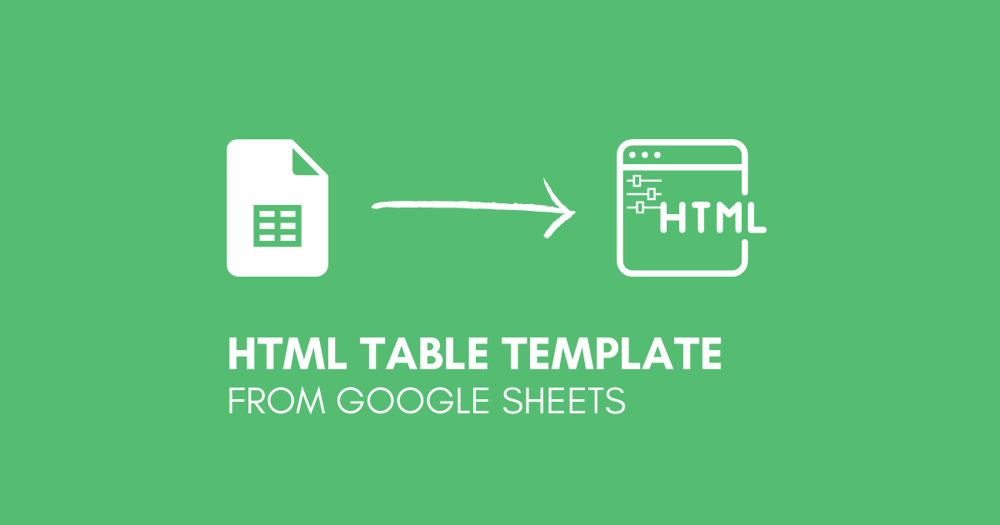
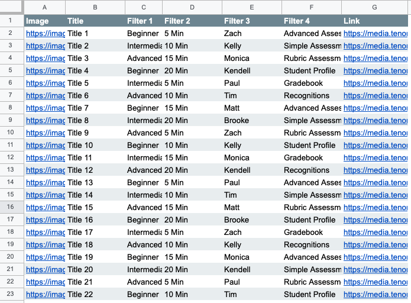

<!-- PROJECT LOGO -->
 

  

  <h3 align="center">Google Sheets to Filterable HTML Table - Template</h3>

  

    More information about this project and others can be found at my website
     
    <a href="https://gabefen.com/"><strong>Learn More »</strong></a>

<!-- TABLE OF CONTENTS -->

  
Table of Contents

  <ol>
    <li>
      <a href="#about-the-project">About The Project</a>
    </li>
    <li>
      <a href="#setup">Setup</a>
    </li>
    <li><a href="#contributing">Contributing</a></li>
    <li><a href="#contact">Contact</a></li>
  </ol>

<!-- ABOUT THE PROJECT -->
## About The Project

This template came out of a need to take table style information stored in a Google Sheet and display it on a website. The main feature it offers is filtering functionality, which can be customized to your needs with minimal changes to the template.

### Setup

1. Publish your sheet as a csv
   - In Google Sheets go to File > Publish to Web
   - Select the Sheet where you data source is located
   - Publish as CSV
   - Copy the published link
2. Customize the table generation function
   - Paste your published link in the url variable
   - Customize the table_data variable to create a table that fits your data
3. Customize Filters
   - Filters can be found in the main HTML body
   - Create options that fit your data
   - Finters use rexeg to filter your data

<!-- CONTRIBUTING -->
## Contributing

Contributions are what make the open source community such an amazing place to be learn, inspire, and create. Any contributions you make are **greatly appreciated**.

1. Fork the Project
2. Create your Feature Branch (`git checkout -b feature/AmazingFeature`)
3. Commit your Changes (`git commit -m 'Add some AmazingFeature'`)
4. Push to the Branch (`git push origin feature/AmazingFeature`)
5. Open a Pull Request

<!-- CONTACT -->
## Contact

Project Link: [https://github.com/gmfennema/Sheets_HTML_Table](https://github.com/gmfennema/Sheets_HTML_Table)
